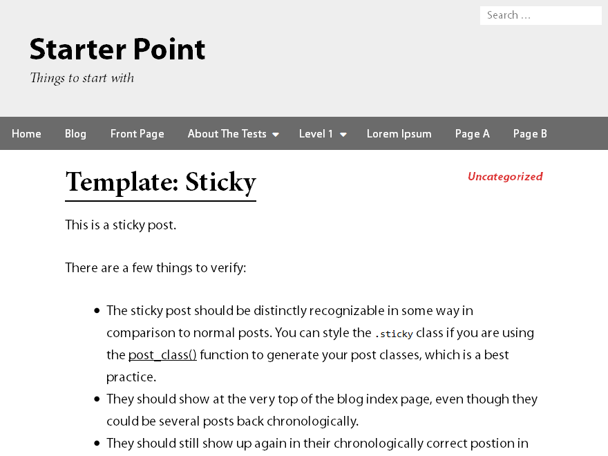
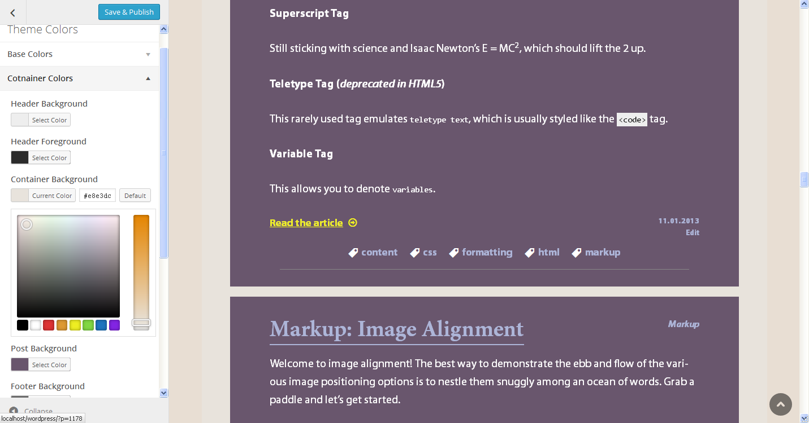
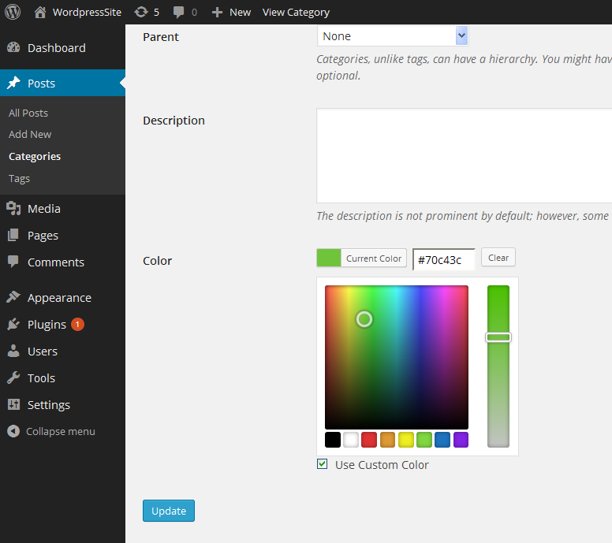
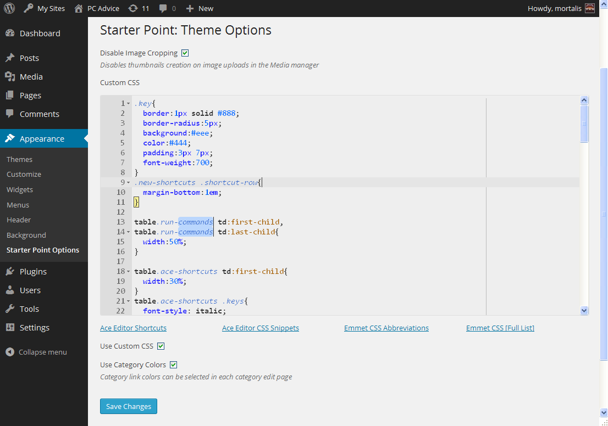

# Starter Point

Requires at least: 4.1  
Tested up to: 4.2  
License: GPLv2 or later  
License URI: http://www.gnu.org/licenses/gpl-2.0.html  

Starter Point is a simple, lightweight, customizable and responsive theme. The theme has ability to add left/right sidebar or disable it to show the content in one column. Posts may have categories and tags. Customizer options allow choose one of the predefined color schemes or change custom theme colors with live preview. Custom header has 3 heights to use for background images. Each category name may have a custom color to distinguish it from others. Customizer also allows to change some layout options. Categories are organized as list of posts in a table rather than the default blog view. The table has sortable columns and shows views count for each post. Front page has one more option to show most viewed posts with a specified posts count. Theme options let you disable image cropping on upload, add custom CSS to pages, restore factory style (default color scheme). Two menu types are available: header and footer menu.

## Features

### Translations

Starter Point ships with English as the default language. Translations are available for:
- Russian (ru_RU)
- Spanish (es_ES)

### Customizer Options

Extended options available from the **Customizer**:

1. Theme colors.
2. Color schemes (**Default, Dark, Blue, Custom**).
3. Category colors (applies colors to category names).
4. Custom layout options (to adjust distances so that a color scheme looks right).
5. Custom header height (**140px, 170px, 250px**).
6. Optional Header image of 1200px wide, height depends on the "Custom header height" option (**1200x140, 1200x170, 1200x250**).
7. Front page option additionally allows to select "Most viewed posts" type and posts count to show (posts are sorted by the views count).

### Showing the content

1. **Blog view**: Blog posts show full content by default, the reduced content is shown when there is a **Read More** link or an Excerpt for a particular post.
2. **Category view**: Posts in a category are listed within a table with sortable headers. The dropdown element allows to change how many posts per page are shown. The table has additional column Views to show how many times a post has been viewed.

### Theme Options

The admin side has the "**Starter Point Options**" page under the Appearance item.  
It has the following options:

1. **Disable Image Cropping**: prevents WP from creating thumbnails of small/medium/large size when uploading images thgrough the Media manager.
2. **Custom CSS** editor is based on the **Ace Editor** engine. Allows to add any CSS style to pages and posts.
3. **Use Custom CSS** option: enables/disables including of the custom CSS from the editor.
4. **Restore Factory Style**: button to remove color scheme style changed in the **Customizer** and to restore the original theme scheme.

## Extras

1. The title of a page shows information about the current page, site name and page number.
2. The Theme supports image galleries with captions appearing on image hover.
3. To Top button appears when a page scrolls down. It performs the smooth upscrolling.
4. The Theme features one custom font: **FontAwesome**.
5. Image attachments have image navigation which is accessible through the Right/Left keys.
6. Additional JavaScript plugins:
 - The accessible main menu is powered by **Superfish**.
 - Responsive triggers powered by **Enquire.js**.
 - Image galleries captions use the **hoverIntent jQuery** plugin. 
 - Smooth image load is powered by the **Lazy Load jQuery** plugin. 
7. The Theme contains original **LESS** files to further improve the styles.
8. The Theme is simple so post tags are disabled in it.
9. The 'Post Nav Bottom Margin' option in **Customizer** applies when comments are disabled for a post or page.

## Links

1. Font Awesome: http://fontawesome.io
2. Superfish: http://users.tpg.com.au/j_birch/plugins/superfish
3. Enquire.js: http://wicky.nillia.ms/enquire.js
4. hoverIntent jQuery plugin: http://cherne.net/brian/resources/jquery.hoverIntent.html
5. Lazy Load jQuery plugin: http://www.appelsiini.net/projects/lazyload
6. Ace Editor: http://ace.c9.io

## To change category color

- Go to the admin side
- Posts -> Categories
- Select a category
- Change color in the Color field

## Changelog

### Version 1.1.1

- **Add**: Uncompressed versions of js plugins
- **Fix**: Warnings when primary menu is disabled
- **Change**: Removed favicon link and meta information from header.php

### Version 1.1.0

- **Add**: Optional sidebar (left/right) and footer widgets area
- **Add**: Tags support in blog main page and single posts
- **Add**: Customizer options: 'Post Nav Left-Right Margin', 'Sidebar Left Padding', 'Sidebar Right Padding' 
- **Add**: Customizer options: 'Footer Menu Width', 'Footer Menu Left Margin'
- **Add**: Customizer options: 'Sidebar Layout', 'Footer Widgets Layout'
- **Fix**: Warnings in debug mode when a page reloads after a color/layout setting is changed in the Customizer
- **Fix**: Animated loader image path (change from absolute to relative)

### Version 1.0.9

- **Add**: Put custom fonts to the theme folder (Myriad Pro, Minion Pro)

### Version 1.0.8

- **Change**: Post views count for non registered users
- **Change**: Removed [rel='prev/next'] meta tags to fix double counting of current and next posts views

### Version 1.0.7

- **Add**: Footer Navigation color options to Customizer
- **Add**: Customizer options: 'Content Area Top/Bottom Margin', 'Last Post Bottom Margin', 'Site Content Bottom Padding'
- **Remove**: Customizer options: 'Content Area Margin', 'Category Site Bottom Padding'
- **Change**: Footer menu position (it's above the footer content)
- **Change**: Footer menu style
- **Change**: Default colors and layouts for default color schemes
- **Change**: 'toTop' button anchor container from the footer itself to its content subcontainer
- **Fix**: Some settings in Customizer didn't save to the database because they didn't change

### Version 1.0.6

- **Add**: Footer menu
- **Add**: Control script for the 'toTop' button to prevent intersection with the footer
- **Add**: Paddings Customizer section
- **Add**: Customizer options: 'Category Bottom Padding', 'Category Site Bottom Padding'
- **Fix**: Customizer didn't load live preview correctly when debugging is enabled
- **Fix**: Synchronized default color scheme with CSS rules in the style.css and content.css

### Version 1.0.5

- **Add**: Meta tags and favicon link
- **Add**: Multisite support: ('category_meta' DB table creates for each site in a network)
- **Add**: Spanish translation (es_ES)

### Version 1.0.4

- **Add**: Use Category Colors global option on the Theme Options page
- **Change**: Added minified and simplified versions of some .js scripts
- **Fix**: Ace editor syntax checking now works
- **Fix**: Ace editor inner margins and full screen behavior in responsiveness aspect
- **Fix**: Warnings for undefined variables on theme install
- **Fix**: Images with empty classes load correctly (lazy load function fix)
- **Fix**: Image keyboard navigation
- **Fix**: Image keyboard navigation loads only for attachment pages
- **Fix**: Some styles for 'hx' elements and word wrapping

### Version 1.0.3

- **Add**: Additional Admin CSS for Options page.
- **Add**: Ace editor Autocompletion feature.
- **Add**: Ace editor CSS Snippets feature.
- **Add**: Ace editor Emmet CSS Abbreviations feature.
- **Add**: Ace editor Search form feature.
- **Add**: Ace editor custom Sublime theme.
- **Add**: Pages to display common Ace editor shortcuts, CSS snippets, Emmet CSS Abbreviations and links for them in the Theme options page.

### Version 1.0.2

- **Add**: Custom CSS editor (Ace Editor) in the Theme Options page.

### Version 1.0.1

- **Add**: Admin style CSS for some paragraphs on the Theme Options page.
- **Add**: Disable Image Cropping option in the Theme Options.
- **Add**: Use Custom Color option in the category edit page. It's possible to select a color for a category and disable its use and save the color for later use.
- **Add**: Customizer option to select the Menu Dropdown Width. It allows to change the width of the dropdown list of menu subitems.
- **Add**: Custom CSS text field in the Theme Options page.
- **Add**: Use Custom CSS option to enable/disable including inline custom style.
- **Change**: Lazy image load feature uses animated loader image.
- **Change**: To Top button vertical coordinate lest it cover the footer on screen reduction.
- **Fix**: With the Use Custom Color option new categories have the default link color (not the black from the category edit page).
- **Fix**: Single attachment entry title aligns properly if no image navigation present.
- **Fix**: Images are loaded with a transparent source and are shown by the Lazy Load script (before images had their own source on load which was not the right way to use Lazy Load).

## Screenshots

---
**Colors Customization**  

---
**Category Colors**  

---
**Theme Options with Ace Editor for the Custom CSS**  

---
